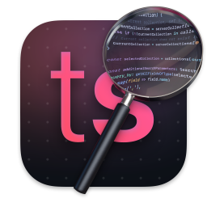

<h1>Typeclient</h1>

A Desktop Client for <a href="https://github.com/typesense/typesense">Typesense</a>

## Install

Download and install the latest version from [the release page](https://github.com/everdrone/typeclient/releases/latest)

## Screenshots

## Warning

This project is still under development!
